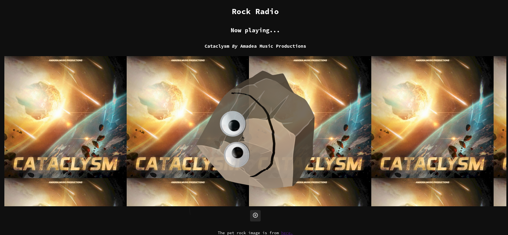

# Rock Radio
Rock Radio is a simple website in which you drop music files on to the rock (any media files your browser supports) into the browser and it will upload the files into OPFS. The website will try to extract the metadata from the files and display (does not support WAV metadata). The songs will then be played randomly (picked by the rock). 

You can press the rock to start and go to the next song. This website is static, built only with Javascript, CSS and HTML.

The rock in the middle also spins while playing music!

The website is available at: [https://kukhua.github.io/Music-Pet-Rock/](https://kukhua.github.io/Music-Pet-Rock/)

Here is a preview of the website:

